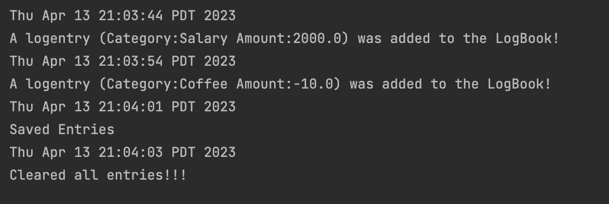

# My Personal Project

 A simple personal finance application which one can use to check their savings or debt. Features include 
entering deposits and expenditure,categorize where you spend the money on like food, shopping,etc., a chart visualizing
the analytics of your monthly expenditure, receiving a star mark next to the months when
you meet the budget and save money. Budgeting is an essential skill especially for teenagers and young adults. Anyone
who wants to learn to budget to save or improve their budgeting skills can use the app to make budgeting more organised
and easy.

### User Stories
- As a user, I want to be able to add amount earned to my logbook.
- As a user, I want to be able to add the amount spent to my logbook.
- As a user, I want to be able to set a category to each entry in my logbook.
- As a user, I want to be able to check my balance for the current year.
- As a user, I want to be able to check my balance for a given month.
- As a user, I want to be able to see my entries.
- As a user, I want to be able to save my logbook to file (if I so choose). 
- As a user, I want to be able to be able to load my logbook from file (if I so choose).
- As a user, I want to be able to see my list of entries.
- As a user, I want to be able to clear all entries.

# Instructions for Grader

- You can generate the first required action related to adding Xs to a Y by adding a logentry to the logbook.
- You can generate the second required action related to adding Xs to a Y by clearing all entries by pressing clear
   entries button.
- You can locate my visual component when opening the app.
- You can save the state of my application by pressing the save button.
- You can reload the state of my application by pressing the load button.

# Phase 4: Task 2
 A representative sample of the events that occur when the program runs.

# Phase 4: Task 3
In my LogEntry class, the parameter category is never actually used and every time it’s initialized the category of the 
LogEntry has to be set to the parameter. This is because when initialized it is always set to “Not Categorized” even 
though LogEntry takes it as a parameter. So category should not be a parameter and log entries don’t need to be 
categorized at the time you make an entry. Furthermore, I could make Category a separate class where we can deal with 
Category like changing, adding or any more features related to Category, and could be dealt with separately, without 
creating any changes in LogEntry or any other class using it. This can reduce cohesion and coupling. Also allowing to 
create a LogEntry with a fully initialized category.

Also, though the GUI is simple while making any modifications to the GUI to add more features, it will be under one 
class. This can make it too lengthy to read. So it can be split into separate classes accordingly, this way it improves 
cohesion.Also having a User Interface like a chart or pie chart displaying the amount earned/spent is helpful and an 
observer pattern to update the UI when a new log entry is added to the Book class could be used. Currently, in the UI 
classes, it is assumed that the user will input the correct format so error handling to handle any exceptions should be 
taken care of.

References:
Took help and inspiration from https://docs.oracle.com/javase/tutorial/uiswing/examples/components/index.html
https://www.tutorialspoint.com/swingexamples/show_confirm_dialog_with_yesno.htm